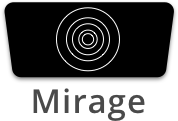
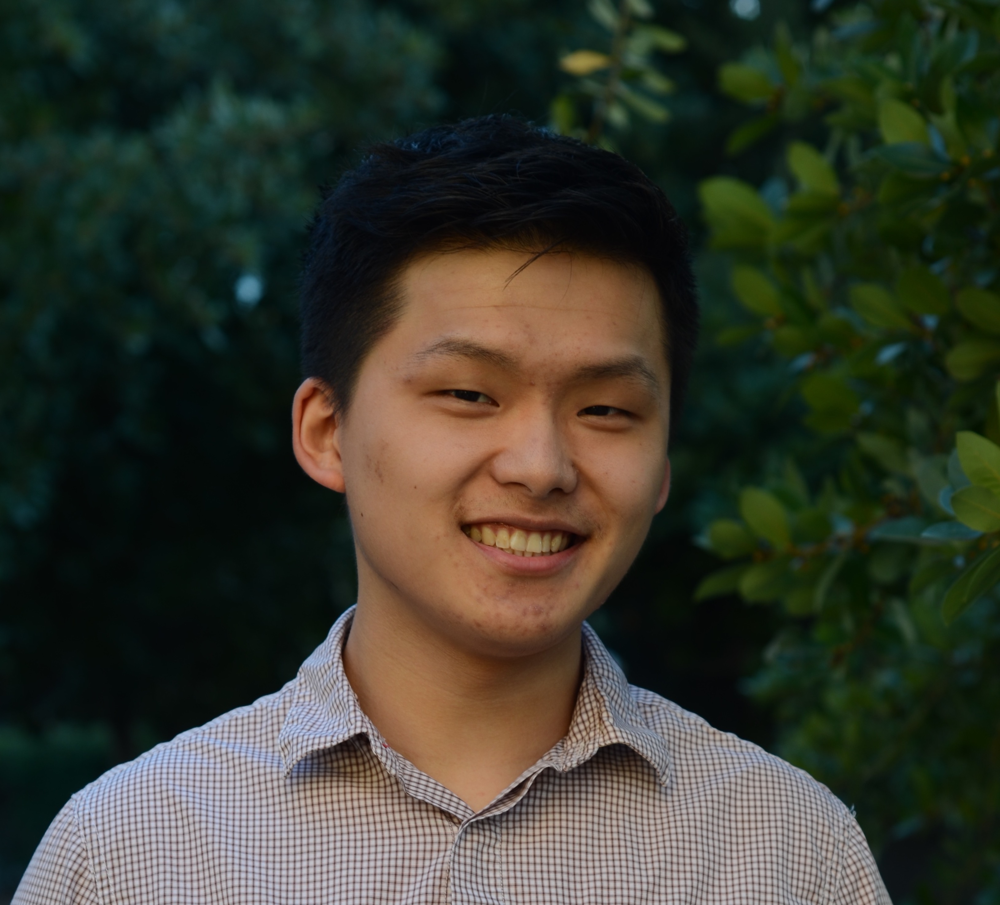
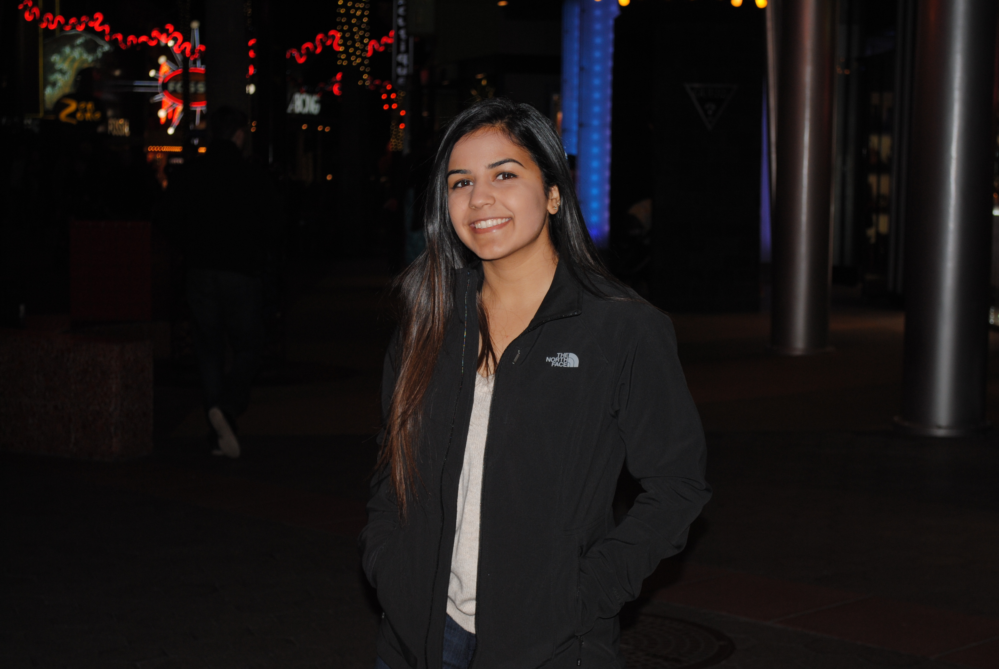
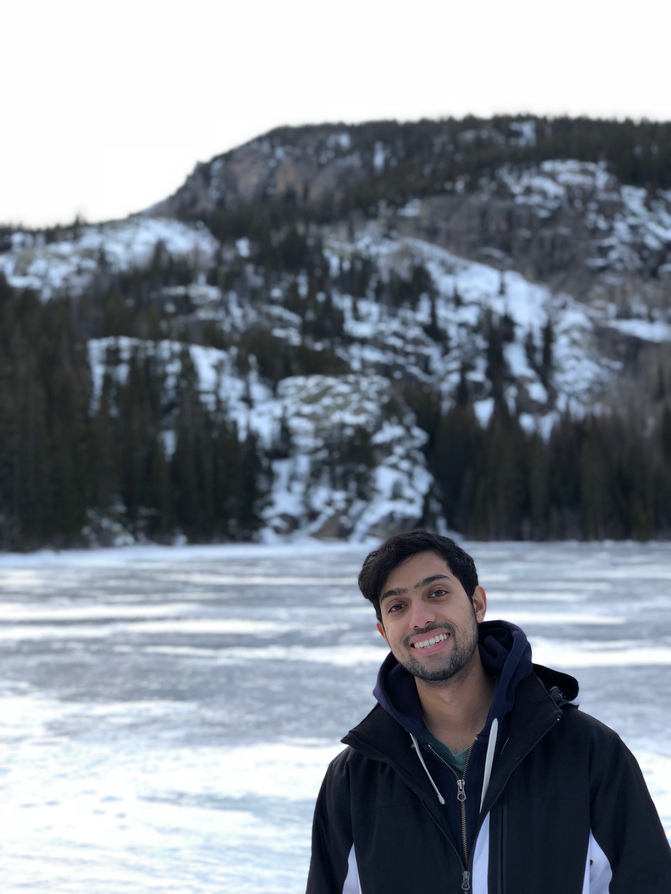

# Mirage

Mirage will be investigating innovations in the VR space, using the Oculus Rift to develop a solution to a current pain-point in VR today. 

# Team Members 
| Member | Photograph | Email |
| --- | --- | --- |
Christian Valadez |  | cvaladez@stanford.edu |
Kyle Qian |  | kyleqian@stanford.edu |
Nishtha Bhatia |  | nishthab@stanford.edu |
Tariq Patanam |  | tpatanam@stanford.edu |

# Team Skills Matrix
| Member | Skills | Personal Traits | Desired Growth | Weaknesses | Hat
| --- | --- | --- | --- | --- | --- |
Christian Valadez | Project Management, full-stack software development, user experience design | Creative, ambitious, entrepreneurial, pragmatic, fun | Management | Stubborn - only sometimes
Kyle Qian | VR/AR, Unity, full-stack engineering | Introspective, critical, deadpan | UX design, UX testing, design documentation | Overly introspective, overly critical, overly deadpan | Black
Nishtha Bhatia | Full-stack software development, product management, human-computer interaction | Organized, empathetic, happy | Large scale project development and documentation, clean usability design | Learning to ruthlessly prioritize | Yellow and Green (tie)
Tariq Patanam | AI, full-stack dev, computer vision, some HCI, product management | Very analytical (philosophy minor) but also creative. Relaxed and chill | Needfinding; scaling + growing a project from nothing to driving user growth | Like Chris, stubborn also - uh oh; moving too cautiously/slowly | Blue hat 

# Team Communication
1. Slack: [miragevirtual.slack.com](miragevirtual.slack.com) (sign up [here](miragevirtual.slack.com/signup)). 
2. [Google Drive](https://drive.google.com/drive/folders/1jfLRd1LUpXFvMFWj3mJqMv_H4NW2ADWq?usp=sharing) for documents.
3. [Asana](https://app.asana.com/0/535441241418527/board?utm_source=asana_email&utm_medium=organic_email&utm_campaign=eng_invite_prod) for task management.
4. [Read the Docs](https://readthedocs.org) for code documentation.
5. Facebook Messenger for inter-team communication.

# Team Theme Song
[Stranger Things Title Sequence](https://www.youtube.com/watch?v=-RcPZdihrp4) 
