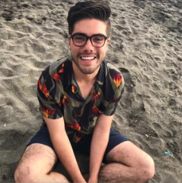

# Mirage

Mirage will be investigating innovations in the VR space, using an Oculus Rift to develop a solution to a current pain-point in VR today. 

# Team Members 
| Member | Photograph | Email |
| --- | --- | --- |
Christian Valadez |  | cvaladez@stanford.edu | 

# Team Skills Matrix
| Member | Skills | Personal Traits | Desired Growth | Weaknesses
| --- | --- | --- | --- | ---
Christian Valadez | Project Management, full-stack software development, user experience design | Creative, ambitious, entrepreneurial, pragmatic, fun | Management | Stubborn - only sometimes
Jose | User testing, CAD, Statistical Data | Very sensitive to work environment | Programming | Programming
Diego | Aesthetics and layout, building prototypes, AutoCAD | Disciplined | LaTeX, Planning Skills | Painting, Programming, Interpersonal communication
Juan | AI, Machine Learning, Programming, GUI skills | Loves learning new programming languages | MatLAB | bad memory
Andrew | Machine Learning, Audio recording, Signal processing, Statistical analysis | Strong opinions, very abstract thinker, Big PIcture guy | Rapid prototyping, project management | Sensitive to environments

# Team Communication
1. Slack: miragevirtual.slack.com 
2. Google Drive for documents 
3. Facebook Messenger for inter-team communication
4. [Read the Docs](https://readthedocs.org) for code documentation

### Team Theme Song
[Stranger Things Theme Song](https://www.youtube.com/watch?v=-RcPZdihrp4) 